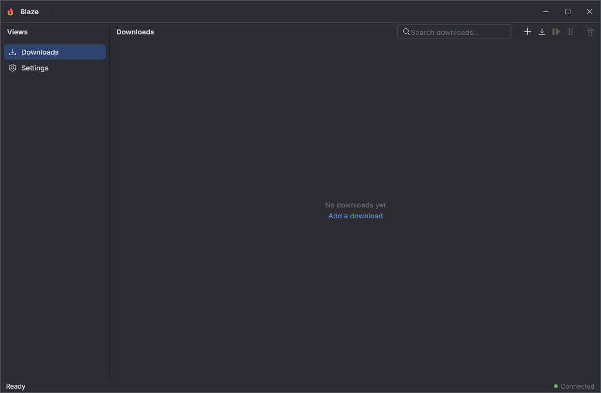
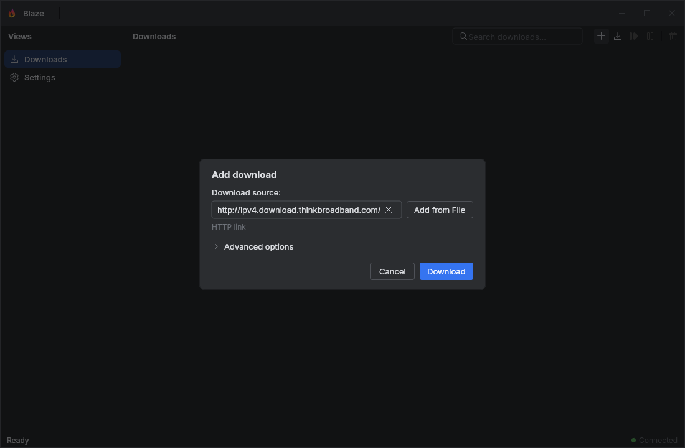
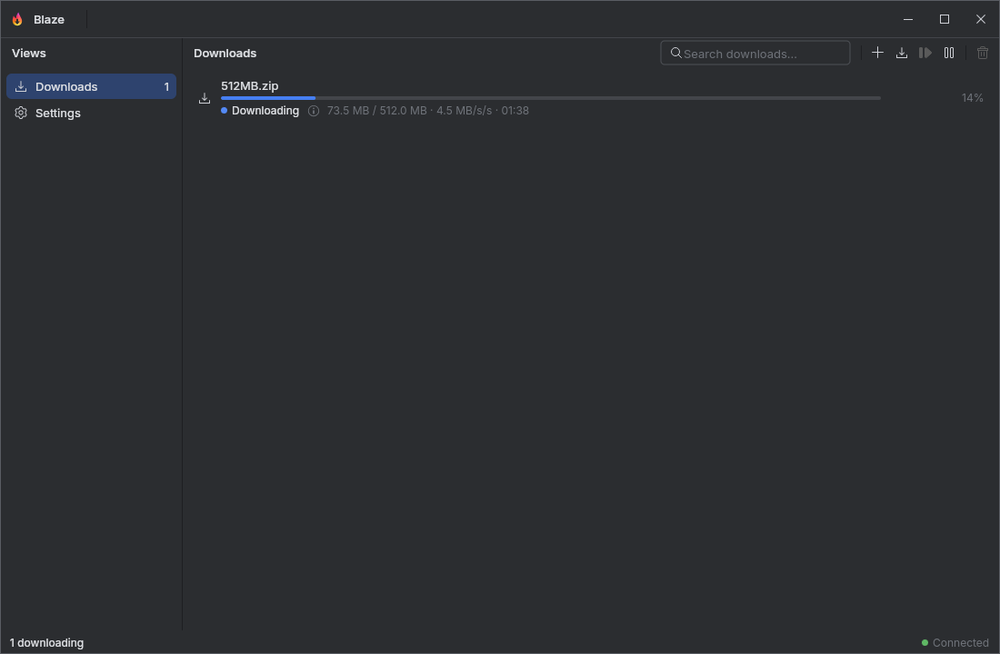
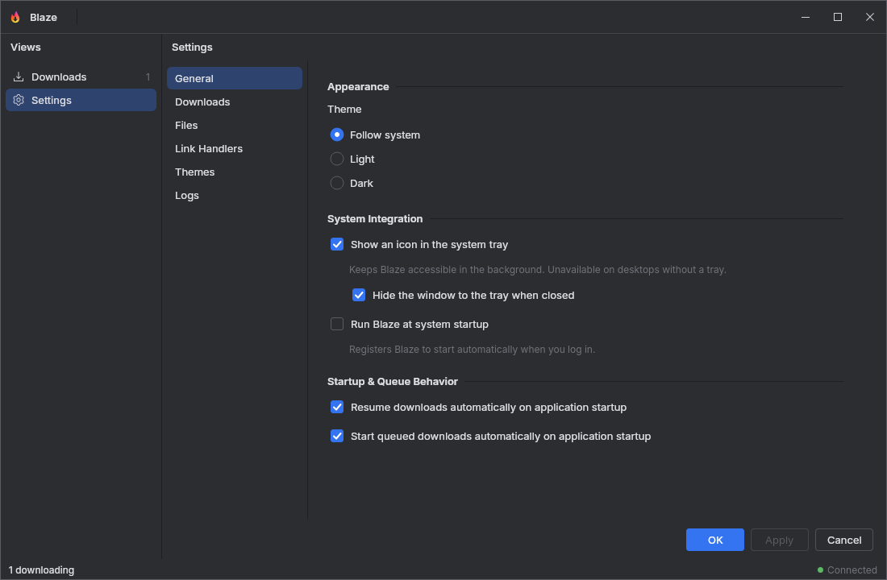

<p align="center">
  
</p>

<h1 align="center">Blaze</h1>

<p align="center">
  A cross-platform, <strong>blazingly fast</strong> download manager.
</p>

<p align="center">
  <a href="https://github.com/kys0ff/blaze-dm/releases"></a>
  <a href="LICENSE"></a>
</p>

<p align="center">
  <a href="#download">Download</a> •
  <a href="#license">MIT License</a> •
  <a href="#features">Features</a> •
  <a href="#built-with">Built With</a> •
  <a href="#getting-started">Getting Started</a>
</p>

---

> ⚠️ **Early-stage software.** Blaze is still cooking. Expect rough edges,
> breaking changes, and the occasional surprise. So far it's been tested on
> **Fedora Linux (KDE Plasma)** and **Windows 10** — other platforms may work,
> may not, or may do something weird. Bug reports and patches are very welcome.

## Download

Grab the latest prebuilt installers (Linux `.deb` / `.rpm` / `.AppImage`, Windows
`.msi`) straight from the
**[releases page](https://github.com/kys0ff/blaze-dm/releases)** — pick the
asset that matches your platform.

Out of the box you get HTTP(S) *and* BitTorrent in one app, chunked parallel
downloads for maximum throughput, resumable & portable transfers, bandwidth
limits, and tight desktop integration (system tray, taskbar progress,
run-at-startup). Full details in [Features](#features) below.

## Screenshots

The main window, the way it's meant to be seen. Drop your captures into the
[`screenshots/`](screenshots/) folder and they'll light up right here.

<!-- TODO: replace these placeholders with real captures from screenshots/ -->

|                    Main window                    |              Add download dialog              |
|:-------------------------------------------------:|:---------------------------------------------:|
|  |  |

|                   Download details                    |               Settings                |
|:-----------------------------------------------------:|:-------------------------------------:|
|  |  |

## Features

- **Multiprotocol** — plain HTTP(S) downloads alongside a native BitTorrent
  client, so one app covers both worlds.
- **Segmented & parallel** — big files get split into chunks and pulled with
  concurrent connections for maximum throughput.
- **Resume & portability** — interrupted downloads pick up where they left off,
  and portable session files let you move an in-progress download between
  machines.
- **Bandwidth control** — speed limits and fairness so your connection stays
  usable while Blaze hammers it.
- **Deep desktop integration** — system tray, close-to-tray, taskbar progress
  (Linux & Windows), run-at-startup, and native packages.
- **Theming & i18n** — plugin-based themes and a locale-driven UI.
- **Link-handler extensions** — register custom resolvers so more link types
  "just work".

## Built With

Blaze is a JVM desktop app, and the stack is very much on purpose:

- **Kotlin** — the queen of this project. Everything is written in it, and it
  shows.
- **Compose for Desktop** — the declarative UI layer underneath it all.
- **Jewel** — borrowed the gorgeous look of the JetBrains IDEs so Blaze feels
  right at home next to IntelliJ, without shipping a whole IDE.
- **Ktor** — the HTTP muscle doing the heavy lifting on web downloads.
- **bt** — a pure-JVM BitTorrent engine for the torrent side of things.
- **Koin** — dependency injection, kept light and idiomatic.
- **Voyager** — screen navigation for the app shell.
- **kotlinx.serialization** — for settings and session persistence.
- **dbus-java** — talking to the Linux desktop (StatusNotifierItem tray, launcher
  entries) without leaving the JVM.
- **Logback / SLF4J** — logging you can configure and control at runtime.

## Project Layout

| Module            | Responsibility                                                                     |
|:------------------|:-----------------------------------------------------------------------------------|
| `download-engine` | Core download orchestration: HTTP(S), BitTorrent, scheduling, resume, portability. |
| `link-resolver`   | Extensible link-resolution / handler system.                                       |
| `theming`         | Plugin-based theme registry and provider safety.                                   |
| `tray`            | App-agnostic system-tray library.                                                  |
| `platform`        | App-agnostic desktop integration (files, clipboard, autostart, taskbar).           |
| `i18n`            | Locale management and UI strings.                                                  |
| `filepicker`      | Reusable file-picker UI and shared presentation components.                        |
| `gui`             | The Blaze application itself — wires everything into the desktop UI.               |

## Getting Started

### Prerequisites

- **JDK 21+** (the build pins a JetBrains Runtime toolchain; jpackage packaging
  uses the SDK configured in [`gradle.properties`](gradle.properties)).
- **Gradle** — just use the bundled wrapper (`./gradlew`).

### Run

```bash
./gradlew :gui:run
```

### Package a native installer

```bash
# Linux (deb/rpm/AppImage), Windows (msi), macOS (dmg) — pick your target.
./gradlew :gui:packageDistributionForCurrentOS
```

### Build & test

```bash
./gradlew build
./gradlew test
```

## License

Blaze is licensed under the **MIT License** — see [LICENSE](LICENSE) for the
full text.

Copyright © 2026 kys0ff
